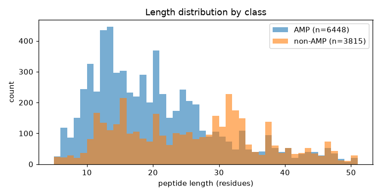
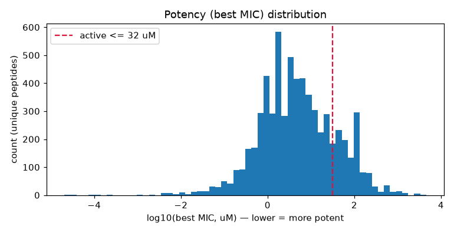
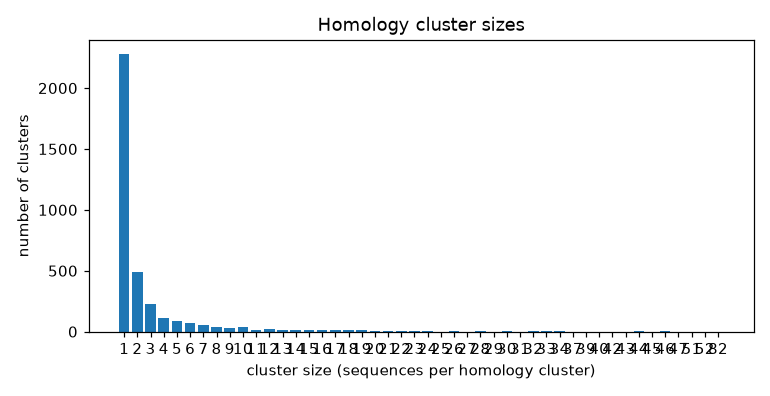

# Data profile — Amphion Phase 1

_Generated from `data/processed/` by `scripts/profile_data.py`. All figures in `reports/figures/`._

## Overview

| Quantity | Value |
|---|---:|
| GRAMPA raw MIC measurements | 51,345 |
| Unique canonical peptides (positives) | 6,448 |
| AMPlify non-AMP negatives (leakage-free) | 3,815 |
| Classification rows (full, imbalanced) | 10,263 |
| Balanced + length-matched subset | 6,698 |
| Homology clusters | 3,614 |
| Active positives (best MIC ≤ 32 µM) | 5,254 |
| Inactive positives | 1,194 |

**Leakage check:** sequences appearing in both classes = **0** (must be 0). ✅

## Labels & conventions
- **Positives:** unique GRAMPA peptides, potency = `min(log10 MIC µM)` across all tested strains (broad-spectrum best activity).
- **Negatives:** AMPlify UniProt-derived non-AMPs, cleaned to the 20 standard amino acids, length 5–50.
- **Active label:** best MIC ≤ 32 µM, i.e. `min_log_mic_uM ≤ 1.5051`. (Alternative ≤25 µg/mL would need per-peptide MW conversion — not applied.)
- **Homology clustering:** greedy single-linkage at identity ≥ 0.6; `cluster_id` stored per sequence for **cluster-aware CV** in Phase 2.

## Class balance & length
The balanced subset is matched 1:1 in 5-residue length bins so the classifier cannot cheat on length alone.

## Potency (MIC) distribution
5,254 of 6,448 positives (81%) are "active" at the ≤ 32 µM threshold.

## Homology clusters
3,614 clusters across 10,263 sequences. Cluster-aware splits prevent near-duplicate leakage between train and test.

## Files
| File | Rows | SHA-256 (first 12) |
|---|---:|---|
| `activity_classification.parquet` | 10,263 | `acede364bc6d` |
| `activity_regression.parquet` | 6,448 | `e65da13825e9` |
| `mic_per_strain.parquet` | 48,891 | `34f2f6a9086b` |

_Built 2026-06-20T20:38:22+00:00 · seed 42._

> Reminder: these are computational predictions with uncertainty, not validated results.
