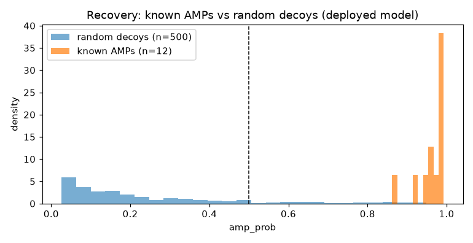
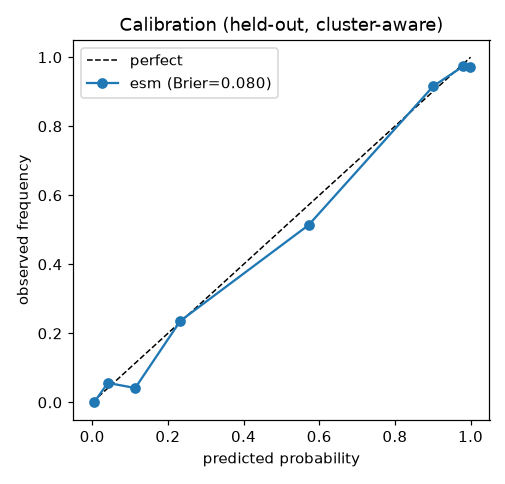
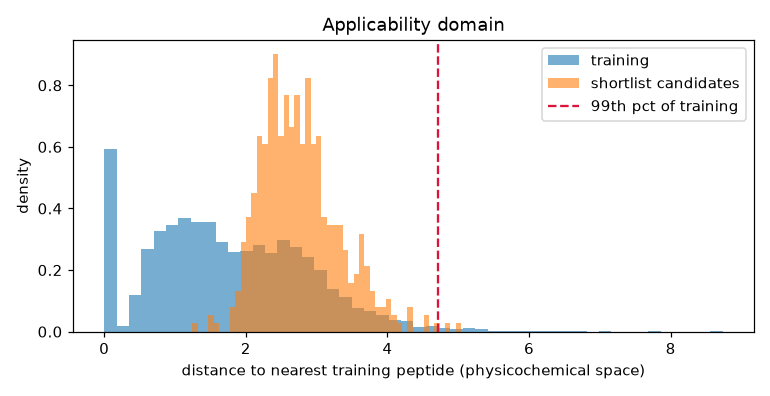

# Amphion — evaluation, benchmarks & honest limitations

## 0. ESM-2 vs hand-crafted features (the hybrid decision)
ESM-2 (a 150M-parameter protein language model) was benchmarked against the 29
hand-crafted features on the **same sequences, labels, and homology clusters**:

| Task | Hand-crafted features | ESM-2 embeddings | Deployed |
|---|---|---|---|
| Activity (AUC) | 0.954 | **0.966** | ESM-2 |
| Toxicity (PR-AUC) | 0.704 | **0.720** | ESM-2 |
| MIC (RMSE, lower=better) | **0.755** | 0.818 | hand-crafted |

**Hybrid decision:** ESM-2 *improved* activity and toxicity but *lost* on MIC regression —
potency is dominated by net charge / hydrophobicity, which the hand-crafted features encode
directly while mean-pooled embeddings dilute. So Amphion deploys each model where it wins:
**ESM-2 for activity + toxicity, hand-crafted features for MIC.** Right tool per job, not hype.

## 1. Headline metrics of the deployed (hybrid) models
| Model | Deployed metric (cluster-aware) | Backend | Published reference |
|---|---|---|---|
| Activity | ROC-AUC **0.966** | esm | AMP Scanner v2 ≈0.96 [1,2] |
| Toxicity | ROC-AUC 0.757 · PR-AUC **0.720** | esm | HemoPI2 ≈0.86 [3,4] |
| MIC | RMSE **0.76** · Spearman 0.50 | baseline | seq-only R²≈0.2–0.5 [5] |

Cluster-aware CV (no near-duplicate leakage) — stricter than the random splits most
published numbers use, so a slightly lower number here can be the more honest one.

## 2. Recovery test — does the deployed model know real AMPs from noise?
12 well-characterized AMPs vs 500 random peptides.
- **Recovery:** 100% of known AMPs scored ≥ 0.5.
- **Separation:** ROC-AUC **0.998** (decoy mean amp_prob 0.23).

> Caveat: several of these classics are in GRAMPA training — a correctness check, not
> a generalization claim (§1 is the generalization number).

| Known AMP | amp_prob |
|---|---:|
| Magainin-2 | 0.99 |
| Melittin | 0.99 |
| LL-37 | 0.99 |
| Indolicidin | 0.98 |
| Cecropin-A | 0.99 |
| Protegrin-1 | 0.86 |
| Buforin-II | 0.93 |
| Aurein-1.2 | 0.95 |
| Pexiganan | 0.99 |
| Pleurocidin | 0.99 |
| HNP-1 | 0.96 |
| Dermaseptin | 0.96 |

## 3. Calibration — is `amp_prob` a trustworthy confidence?
Held-out, cluster-aware on the deployed **esm** activity backend
(n=2000): isotonic-calibrated, **Brier 0.080** (lower better; 0.25 = uninformative).

## 4. Applicability domain — are the candidates in-distribution?
**100%** of the shortlist lies within the 99th-percentile
nearest-neighbour distance of the training set (physicochemical space). Beyond it = extrapolation.

## 5. Uncertainty
Every shortlisted candidate carries an `amp_uncertainty` (spread across the calibrated CV
ensemble) in `shortlist.csv`.

## 6. Limitations (read this)
- **Predictions ≠ proof.** No software confirms a real bacterial kill or human-cell safety;
  physical validation is Stage 3 (wet lab), out of scope.
- **Negatives are a modeling choice** (UniProt decoys answer "is this an AMP at all?").
- **Distribution shift:** the generator can propose out-of-distribution peptides; §4 is a guard.
- **MIC regression is modest** (R² ~0.25) — `pred_mic_uM` is a coarse ranking aid, not a number.
- **ESM-2 did not help everywhere** — it lost on MIC (see §0); we deploy it only where it wins.
- **Generator posterior collapse** — some raw VAE samples echo training motifs; the novelty
  filter removes them.

> Every number here is a computational prediction with uncertainty. Amphion is a
> *prioritized, transparent shortlist* for experimental testing — not validated drugs.
